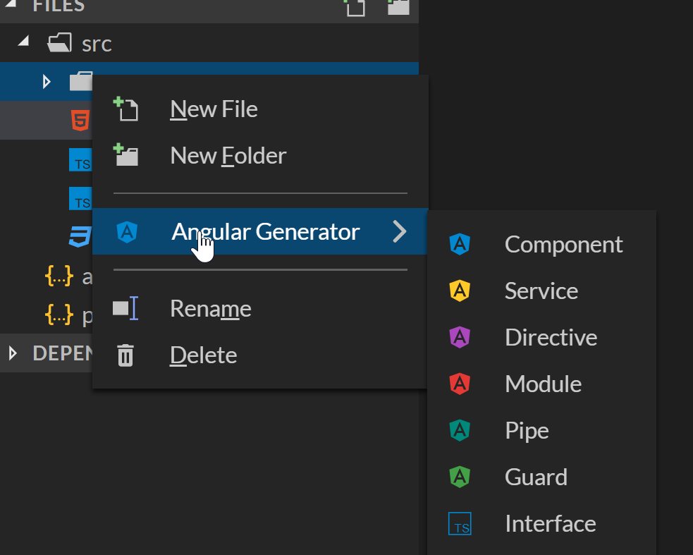
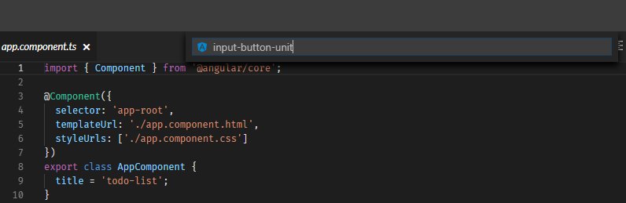

# a. Instruções para o StackBlitz

Nós iremos utilizar o Angular Generator para criar um novo componente.

Clique com o botão direito do mouse na pasta `app` e selecione **Angular Generator** e então selecione **Component**.

Uma pequena caixa de texto irá aparecer no topo do painel do editor. Digite `input-button-unit` para criar o componente.

Você agora tem um novo componente!

Agora nós iremos manualmente mover o HTML para fazer com que esse componente utilize o inline template. Nós iremos repetir o que fizemos no capíutlo [\#3: 📐 Component](hhttps://github.com/ng-girls/todo-list-tutorial-portuguese/blob/master/component.md).

Copie todo o código do arquivo `input-button-unit.html`. No arquivo `input-button-unit.component.ts`, mude `templateUrl` para `template` e cole o HTML entre **backticks**.

Você deve deletar o arquivo `input-button-unit.html`.

Retorne a página anterior para [continuar o tutorial](hhttps://github.com/ng-girls/todo-list-tutorial-portuguese/blob/master/a-new-component/a_new_component.md).