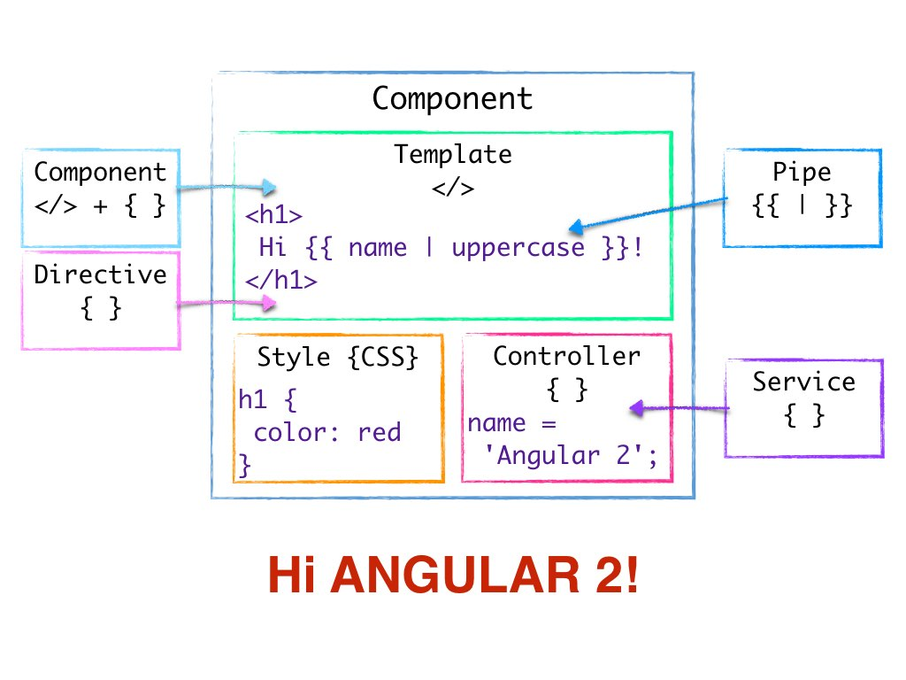

# Component

Uma abordagem em desenvolvimento Web \(e desenvolvimento de software em geral\) é a arquitetura baseada em componentes (component-based architecture). No passar dos anos isso ganhou muita popularidade. O que é um componente? 

Helmut Petritsch define em [Service-Oriented Architecture \(SOA\) vs. Component Based Architecture](http://petritsch.co.at/download/SOA_vs_component_based.pdf):

> Um componente é um objeto de software, feito para interagir com outros componentes, encapsulando certas funcionalidades ou um conjunto de funcionalidades. Um componente possui uma interface claramente definida e está em conformidade com um comportamento prescrito comum a todos os componentes dentro de uma arquitetura.

Em aplicações Web, **um componente controla um fragmento de tela chamado de View (visualização)**. É uma parte do que você vai eventualmente ver na tela. Tem um template, no qual define sua estrutura visual. Também tem uma lógica no qual define o comportamento e os valores dinamicos. A parte lógica é código Javascript e é chamado de controlador. 

Aqui está o diagrama de um componente em Angular, com o resultado abaixo. 


Diretivas, pipes e serviços são outros blocos de construção em Angular, no qual vamos discutir mais tarde neste tutorial. 

Vamos dar uma olhada no componente que foi criado em Angular-CLI. Todos os arquivos relevantes estão na pasta `src/app`. Abra o arquivo `app.components.ts`.

Igual ao ngModules que nós vimos no capitulo anterior, um componente é também definido por uma classe com um decorador. Está é a definição da classe:
```js
export class AppComponent {
  title = 'todo funciona!';
}
```
Tem um membro chamado "titulo". É uma variavel no qual você pode atribuir um valor. O valor atribuido aqui é a string "todo funciona!".

O Angular cuida da sincronização dos membros do componente com o componente template. Então podemos usar facilmente o membro `title` no template. Dê uma olhada no template anexado ao componente em:

```html
<h1>
  {{ title }}
</h1>
```
As chaves duplas e seu conteúdo são chamados de **Interpolação**. Isso é uma das formas de ** data binding ** em Angular. Como nós mencionamos anteriormente, o código neste arquivo não é usado como quando o navegador renderiza o componente. Angular compila isso para o código Javascript. Em um dos passos de compilação ele procura pela Interpolações dentro do template. **O conteúdo da interpolação é uma expressão, escrita em Javascript.** Em tempo de execução a expressão é avaliada, e aí você vê o resultado. 

Interpolação é um dass mais fortes e mais básicas caracteristicas em Angular. Existe desde o inicio do Angular - na primeira versão. Isso torna realmente simples a inserção de dados dinâmicos no View.  

In this component, the expression is simply the member of the component class, `title`. **Let's try to change it**. Try out the following and see the result in the browser. \(With every change you make in the file, the browser will refresh automatically!\)

* Remove the curly braces and keep just the content `title`
* Put back the curly braces and replace the content with some mathematical expression, for example: `{{ 2 + 2 }}`. \(The spaces are not mandatory, they just make the code more readable.\)
* Write a mathematical expression combined with the `title` member: `{{ title + 10 }}`
* Pass an undefined variable to the expression - a variable which was not declared in the component class. For example: `{{ x }}`
* Try out anything you'd like. Don't worry - you can't do any harm to the browser or the computer! In the worst case, the browser will run out of memory and will get stuck. \(But you'll have to write something really complicated to make that happen!\)

This is one way that you can bind members of the component's controller to its template. How does Angular know that this is the template of the App component?

Let's go back to the file `app.component.ts` and look at the component's meta-data defined in the decorator `@Component` right above the class definition:

```js
@Component({
  selector: 'todo-root',
  templateUrl: './app.component.html',
  styleUrls: ['./app.component.css']
})
```

We pass an object of definitions to the decorator, just like we saw in the previous chapter with ngModule. The second property, `templateUrl` tells Angular where to look for the template attached to the component. There is another option to point to the template, which is better practice: to write the whole template inline here, in the component definition. We will discuss it later.

The third property, `styleUrls` tells Angular where to look for the CSS files that define the style of this component. It can have multiple CSS files. That's why the value of `styleUrls` is an array. You can take a look at the CSS file `app.component.css` - you'll see that it's empty. You can add some CSS style here, for example:

```css
h1 {
  color: red;
}
```

We'll add more style later on.

The first property, `selector`, tells Angular what will be the name of the tag that we'll use to call the component. As we saw in the file `src/index.html`, we use the app component inside the body:

```html
<body>
  <todo-root>Loading...</todo-root>
</body>
```

The element `todo-root` is not an HTML element. It is the component that was created with the selector `todo-root`. Try changing the selector. You'll see that if you change it in only one of the files, "Loading..." will be displayed. This is the content that we gave to the tag in `index.html`, and it is rendered as long as the element is not replaced with an Angular component. You can see in the browser's console an error message.

One last thing, the first line in the component file imports the code that defines the decorator `@Component`. It is needed to use the decorator, which is defined in the imported file \(or actually, in one of its own imports\). Try removing this line, and see the error.

#### Inline Template
Let's move the template to be **inline** in the component definition. This will help us manage the template while looking at its functionality.
In the file `app.component.ts`  replace the line

```js
templateUrl: './app.component.html',
```

with

```js
template: ``,
```

Notice the **backticks** - they are used to define Template Literals, which are new in JavaSript \(ES6\). This way you can define multi-line strings. They have another cool ability: to easily use JavaScript variables and expressions within the string \(with no relation to Angular binding expressions in the template\). Read about it in the [MDN documentation](https://developer.mozilla.org/en/docs/Web/JavaScript/Reference/Template_literals).

Make sure you replace `templateUrl` with `template` and don't forget the comma in the end of the line.

Now copy the entire template from `app.component.html` and paste it between the backticks.  We'll reformat the code a bit to have it easier on the eye:

```js
template: `
  <h1>
    {{ title }}
  </h1>  
`,
```

It is easier to manage the template when you see its controller at the same time. This is true as long as the template doesn't get too big and the controller doesn't get too complicated. If they do, it's a sign you should refactor your code by breaking it down to child components.

At this point you can delete the file `app.component.html`.
>When generating a new project, you can state that you'd like an inline template for the root component by adding the flag `-it` (or `--inline-template`). Keep this in mind for your next project!

The same way we use inline template, we can use also inline styles. But for now we will keep the styles in a separate file.

### Summary
We have explored the root component that was generated for us by Angular-CLI, and even refactored it. In the next chapter we will create a new component. We will start building the tree of components, which defines the structure of the application.

